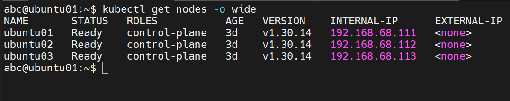
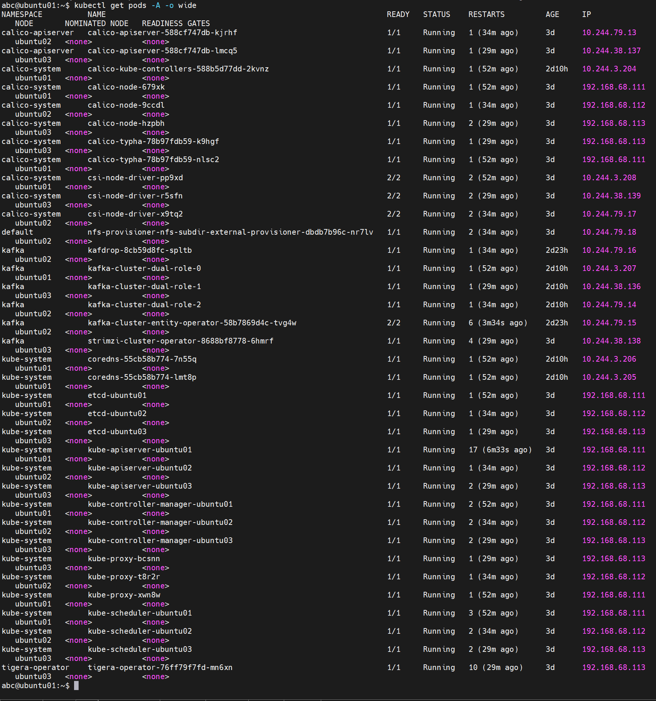
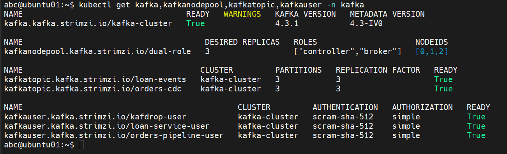
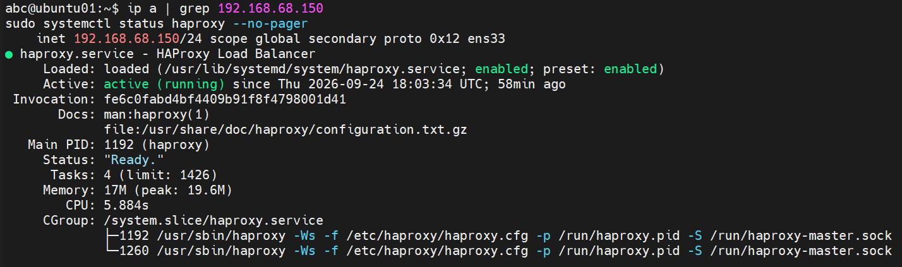
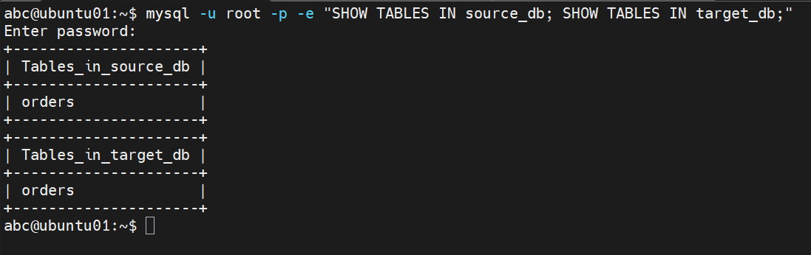
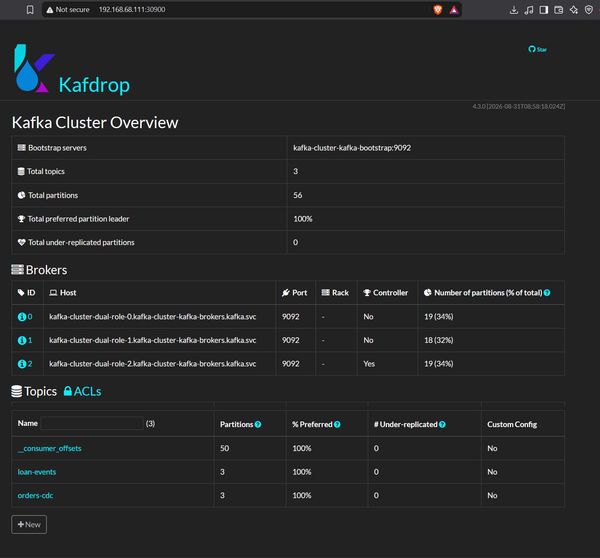
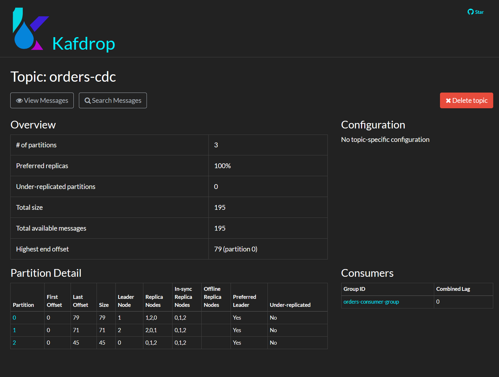
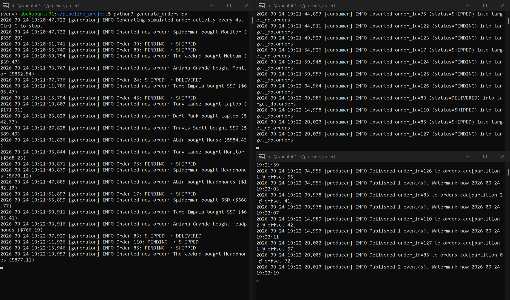
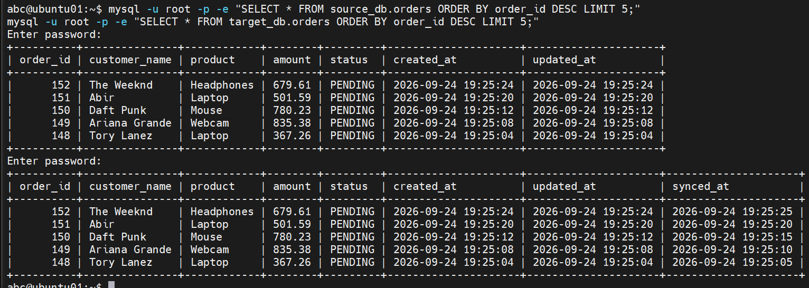

# MySQL -> Kafka -> MySQL pipeline

# Kafka Cluster with Polling-Based Change Capture

A small data pipeline built to learn Kafka and Kubernetes hands-on. One script reads new or changed rows from a MySQL table, publishes them to Kafka, and a second script consumes those events and writes them into a separate MySQL table.

The Kafka cluster runs on a 3-node Kubernetes cluster (3 Ubuntu VMs) using the Strimzi operator in KRaft mode (no Zookeeper).

Change detection is polling-based rather than true CDC, a Python script checks the `updated_at` column every few seconds and picks up anything new, instead of using Debezium or Kafka Connect. This isn't log-based CDC (which reads the database binlog and guarantees nothing is missed), but building the polling version first made the underlying mechanics clear before relying on a pre-built connector.

## What's in here

```
k8s/
  kafka-cluster.yaml   Kafka cluster + node pool (KRaft, 3 brokers)
  kafka-users.yaml     Kafka topic + users with SCRAM auth
  kafdrop.yaml         Kafdrop (web UI for looking at Kafka topics)

pipeline/
  schema.sql           MySQL tables + users
  config.py            all the connection settings 
  producer.py          reads MySQL, sends to Kafka
  consumer.py          reads Kafka, writes to MySQL
  generate_orders.py   just makes fake orders so there's something to test with
  requirements.txt
```

## Cluster setup

3 Ubuntu Server VMs, 3 vCPU and 4GB RAM each. Set up with kubeadm as a proper HA cluster (etcd on all 3 nodes, not just one), HAProxy + Keepalived in front so there's one IP address for the API server even if a node goes down. Calico for pod networking.

All 3 nodes run workloads too since I don't have extra machines lying around for separate worker nodes. That means the control-plane taint stays on and everything I deploy needs a toleration for it or it just won't schedule.

## Kafka stuff

Used Strimzi to run Kafka. 3 brokers, KRaft mode. Two listeners - one for things inside the cluster, one NodePort listener so my Python scripts (which run outside Kubernetes, directly on the MySQL machine) can connect too.

Some things that took me a while to figure out:

- If you don't set a fixed NodePort number in the config, Kubernetes just picks a random one every time you rebuild the cluster, so your app suddenly can't connect and it's not obvious why.
- You need `authorization: simple` turned on at the Kafka cluster level or none of your users with ACLs will actually work, and the error message doesn't really tell you that's the problem.
- The entity operator (the thing that creates topics/users) is a separate deployment from the brokers and doesn't get the same toleration automatically, so it just sits there Pending until you add one for it too.
- Kafdrop kept getting stuck - pod said Running but the website wouldn't load and I couldn't even exec into the container. Turned out the memory limit was too low (160Mi) for it to actually finish starting up. Bumped it to 512Mi and it worked.

## MySQL

Runs on the same machine as my Python scripts, not inside Kubernetes - didn't see a reason to put it in the cluster. Two databases (source and target), and instead of using one user for everything I made separate MySQL users with only the permissions they actually need.

## How to run it

Setting up the cluster and Kafka is done by hand step by step (kubeadm init, joining nodes, installing Calico, installing Strimzi, then applying the yaml files in `k8s/`).

Once that's all running:

```
mysql -u root -p < pipeline/schema.sql
```

(fill in passwords in schema.sql first)

```
kubectl get secret kafka-cluster-cluster-ca-cert -n kafka -o jsonpath='{.data.ca\.crt}' | base64 -d > pipeline/ca.crt
```

Then fill in config.py passwords and run:

```
cd pipeline
python3 -m venv venv
source venv/bin/activate
pip install -r requirements.txt

python3 consumer.py
python3 producer.py
python3 generate_orders.py
```

Open each of those in its own terminal. Then just watch `target_db.orders` catch up with `source_db.orders`, or open Kafdrop in a browser and watch the messages come in.

## How the pipeline works

The producer checks `source_db.orders` every 5 seconds for any row with a newer `updated_at` than last time, turns it into JSON, and sends it to Kafka. It keeps track of the last timestamp it saw in a text file so it doesn't resend everything if it restarts.

The consumer reads those messages and writes them into `target_db.orders`. It only marks a message as "done" in Kafka after the MySQL write actually succeeds, so if something crashes halfway through, that message just gets processed again instead of getting lost.

One bug that took me forever to find: the producer would just say "no new rows" forever even after new orders were clearly in the database. Turned out I needed to set `autocommit = True` on the MySQL connection. Without it, MySQL keeps showing the same old snapshot of the table to that connection and never refreshes it.

## Screenshots

**Cluster & Kafka health**

| | |
|---|---|
|  |  |
| `kubectl get nodes -o wide` | `kubectl get pods -A -o wide` |

| | |
|---|---|
|  |  |
| Kafka cluster, topics, users all `READY` | Floating VIP held + HAProxy status |

**MySQL**



**Kafdrop**


*Kafdrop's overview page — brokers and topics.*


*`orders-cdc` topic — 3 partitions, fully in-sync (no under-replication), consumer group lag at 0.*

**Pipeline running end-to-end**


*Generator inserting orders, producer publishing to Kafka, consumer upserting into `target_db` — all live at once.*

**Data consistency check**


*`source_db.orders` and `target_db.orders` matching after the pipeline processed new events.*

## Passwords

Every password in this repo is replaced with `*******`. You need to put in your own before any of this will actually run.
